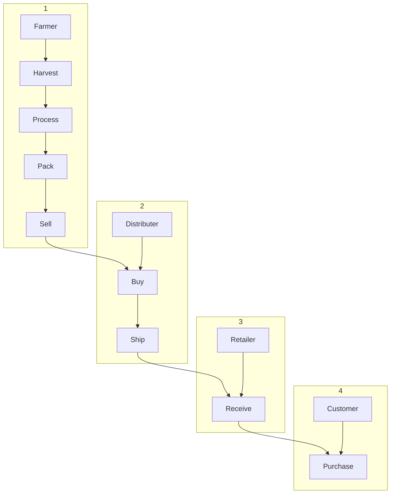
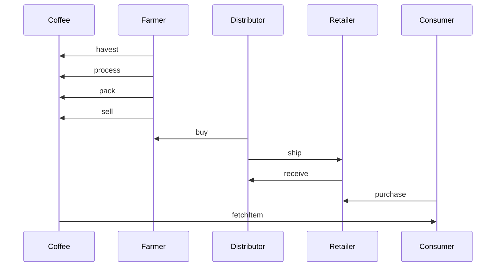
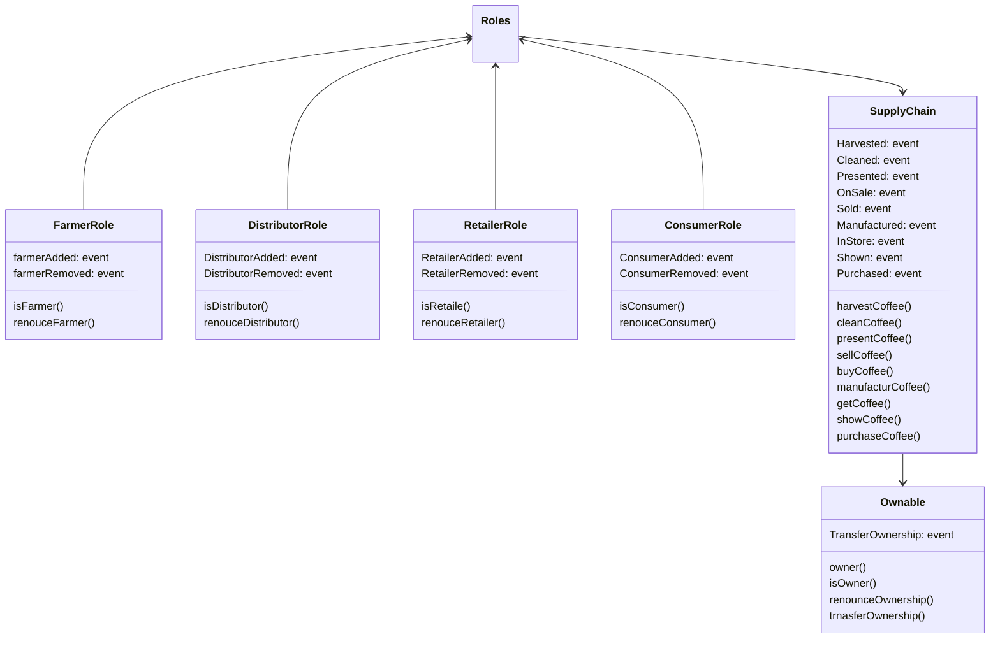
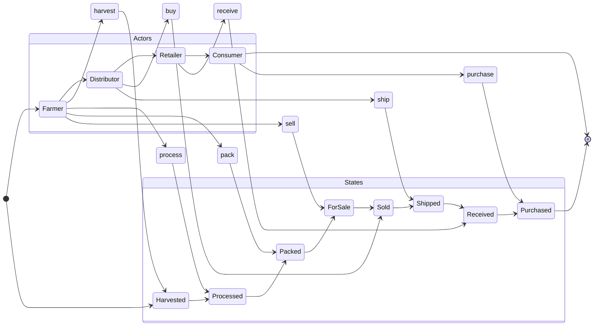

## Activity Diagram

```mermaid
flowchart TB

    Sell-->Buy

    subgraph 1
    Farmer -->Harvest -->Process-->Pack-->Sell
    end

  
    Ship-->Receive
    subgraph 2
    Distributer -->Buy -->Ship
    end
    subgraph 3
    Retailer -->Receive
    end

    Receive-->Purchase

    subgraph 4
    Customer -->Purchase
    end

```

## Sequence Diagram

```mermaid

sequenceDiagram
    participant  Co as Coffee
    participant F as Farmer
    participant  D as Distributor
    participant R as Retailer
    participant  C as Consumer


    F->>Co: havest
    F->>Co: process
    F->>Co: pack
    F->>Co: sell
    D->>F: buy
    D->>R: ship
    R->>D:receive
    C->>R:purchase
    Co->>C: fetchItem
```

## DataModel Diagram

```mermaid
classDiagram
    class Roles

    class FarmerRole{
        farmerAdded: event
        farmerRemoved: event
        isFarmer()
        renouceFarmer()
        }

    class DistributorRole{
        DistributorAdded: event
        DistributorRemoved: event
        isDistributor()
        renouceDistributor()
        }

    class RetailerRole{
        RetailerAdded: event
        RetailerRemoved: event
        isRetaile()
        renouceRetailer()
        }

    class ConsumerRole{
        ConsumerAdded: event
        ConsumerRemoved: event
        isConsumer()
        renouceConsumer()
        }

    class SupplyChain{

        Harvested: event
        Cleaned: event
        Presented: event
        OnSale: event
        Sold: event
        Manufactured: event
        InStore: event
        Shown: event
        Purchased: event

        harvestCoffee()
        cleanCoffee()
        presentCoffee()
        sellCoffee()
        buyCoffee()
        manufacturCoffee()
        getCoffee()
        showCoffee()
        purchaseCoffee()
    }

    class Ownable{
        TransferOwnership: event
        owner()
        isOwner()
        renounceOwnership()
        trnasferOwnership()
    }

    Roles <--FarmerRole  
    Roles <--DistributorRole
    Roles <--RetailerRole
    Roles <--ConsumerRole

    Roles-->SupplyChain

    SupplyChain-->Ownable

```
## State Diagram

```mermaid
stateDiagram 
    direction LR

   


    state Actors{
   
    Farmer-->Distributor
    Distributor-->Retailer
    Retailer-->Consumer
    }

  


    state States{

    Harvested-->Processed 
    Processed-->Packed
    Packed-->ForSale
    ForSale-->Sold
    Sold-->Shipped    
    Shipped-->Received
    Received-->Purchased  
    }

    [*] -->Farmer
    Consumer-->[*]
    [*]-->Harvested
    Purchased-->[*]

    Farmer-->harvest
    harvest-->Harvested

    Farmer-->process
    process-->Processed

    Farmer-->pack
    pack-->Packed

    Farmer-->sell
    sell-->ForSale


    Distributor-->buy
    buy-->Sold
    Distributor-->ship
    ship-->Shipped

    Retailer-->receive
    receive-->Received

    Consumer-->purchase
    purchase-->Purchased


```